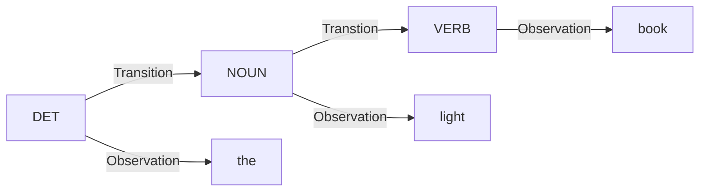

-  Continuing with the previous example 
  ![[Pasted image 20230623212212.png]]

-  There can be 32 different sequences of tags for this starting sentence. If we try to find the correct sequence in a naïve way then we will repeat some common  computations again for different sequences. 
  
-  For example:
  1. First path - $VBD-->TO-->VB-->DT-->NN$
  2. Second path -  $VBD-->TO-->JJ->DT-->NN$
     -  One can see that $DT-->NN$  is common in both the paths so we can make use of <font color = "green">Dynamic Programming</font> to save the best possible sub-path to reach $DT$  so that we can reuse that result for different paths with a common sub-path  $DT--> NN$.
       - In this case, we have to find the max of all the probabilities reaching  to step 4 i.e. at  $the$ . There are total 4 tags before  $DT$  so total 4 different probabilities  to compare.


-  Optimal path for each state can be recorded by storing the 
  1. Cheapest  Cost to state $j$  at step  $s$   aka Viterbi Path Probability:   $\delta_j(s)$ 
  2. Best predecessor  of the current state $j$  at step  $s$ :  $\psi_j(s)$
-  Here, **steps** are the **words** and **states** are the **tags** .
- Computing  $\delta_j(s + 1)$  and  $\psi_j(s + 1)$  :
$$ \delta_j(s  + 1) = \max_{1 \; \le \; i \; \le \; N} \; \delta_i(s) \cdot p(t_j \;|\; t_i) \cdot p(w_{s + 1} \;|\; t_j)$$
$$\psi_j(s + 1) = \underset {1 \; \le \; i \; \le \; N}{\operatorname{arg max}} \;\ \delta_i(s) \cdot p(t_j \;|\; t_i) \cdot p(w_{s + 1} \;|\; t_j)$$
$p(t_j \;|\; t_i)$  -->  Transition probability 
$p(w_{s + 1} \;|\; t_j)$  --> Emission probability

-  At the end of the sentence we can get the best final state(tag) and **backtrack** from there to get the sequence of tags.

###### Question
![[Pasted image 20230627162119.png]]
![[Pasted image 20230627165400.png]]

###### Answer
![[Pasted image 20230627162431.png]]

-  In the question it is given that the probability of a tag occurring at the start of the sentence is same for all tags.
-  Therefore,  $$P(tag \ | <S>) = \frac{1}{No. \ of \ tags} = \frac{1}{4}$$
#### Step - 1
-  For the first word  $the$ there are only two POS tags $\; DET, \; NOUN \;$ so $\; 1 \; \le \; j \; \le \; 2 \;$  and we have to calculate $\delta_1(1)$  and $\delta_2(1)$ ,   

For  $j=1$  i.e. $DET$
$$\delta_{1}(1) = max \; (\; P(DET|<S>) \; \cdot \; P(the \; | \; DET) \;) =max(\frac{1}{4} \cdot 0.3) = 0.075$$
For  $j =2$  i.e. $NOUN$
$$\delta_2(1) = max \; (\; P(NOUN|<S>) \; \cdot \; P(the \; | \; NOUN) \;) =max(\frac{1}{4} \cdot 0.1) = 0.025$$

-  Here at the start of the sentence $\delta_i(0)$  cannot be calculated so at step 1 we can ignore $\delta_i(0)$ and also  $\psi_{i}(0)$  does not exist.


#### Step - 2
- Here for the word  $light$  there are three possible tags $NOUN, \; ADJ, \; VERB \;$ so   $\; 1 \; \le \; j \; \le \; 3 \;$ and we have to calculate $\delta_1(2)$ ,  $\delta_2(2)$  and  $\delta_3(2)$

For  $j = 1$  i.e. $NOUN$,
$$
\begin{split}
\delta_{1}(2) = \operatorname{max} \; ( & \; \delta_1(1) \cdot P(\; NOUN\; | \; DET\; ) \; \cdot \; P(light \; | \; NOUN),\\
& \delta_2(1) \cdot P(\; NOUN\; | \; NOUN\;) \; \cdot \; P(light \; | \; NOUN)\;)
\end{split}
$$
$$
\begin{split}
\delta_{1}(2) &= \operatorname{max} \; (\; (0.075 \times 0.5 \times 0.0003), (0.025 \times 0.2 \times 0.0003)\; ) \\
&= \operatorname{max}\;(11.25 \times 10^{-5}, \; 1.5 \times 10^{-5})\\
&= 11.25 \times 10^{-5}
\end{split}
$$
-  Therefore the probability is max where  $DET$   was the previous tag therefore $\psi_1(2) = DET$.
  ```mermaid
graph LR;
  DET --Transition--> NOUN;
  DET --Observation --> the
  NOUN --Observation--> light
```
-  We do the same for rest of the POS tags. 


#### Step - 3
-  Here for the word  $book$  there are two possible tags  $VERB,\; NOUN$  so $\; 1 \; \le \; j \; \le \; 2 \;$and we have to calculate $\delta_1(3)$ and  $\delta_2(3)$.

For $j = 1$  i.e. $VERB$,

$$
\begin{split}
\delta_{1}(3) = \operatorname{max} \; ( & \; \delta_1(2) \cdot P(\; VERB\; | \; NOUN\; ) \; \cdot \; P(Book \; | \; VERB),\\
& \delta_2(2) \cdot P(\; VERB\; | \; ADJ\;) \; \cdot \; P(Book \; | \; VERB),\\
& \delta_3(2) \cdot P(\; VERB\; | \; VERB\;) \; \cdot \; P(Book \; | \; VERB)\;)
\end{split}
$$
$$
\begin{split}
\delta_{1}(3) &= \operatorname{max} \; (\;(0.0045 \times 10^{-5} \times 0.1 \times 0.01),\\ 
&(4.5 \times 10^{-5} \times 0.001 \times 0.01),\\ 
&(11.25 \times 10^{-5} \times 0.3 \times 0.01)\;) \\
&= \operatorname{max}\;(0.0045 \times 10^{-5}, \; 0.000045 \times 10^{-5}, \; 0.03375 \times 10^{-5})\\
&= 0.03375 \times 10^{-5}
\end{split}
$$
-    Therefore the probability is max where  $NOUN$   was the previous tag therefore $\psi_1(3) = NOUN$.
  ```mermaid
graph LR;
DET --Transition-->NOUN
  DET --Observation--> the
  NOUN --Transition--> VERB;
  NOUN --Observation--> light
  VERB --Observation--> book
```

For $j = 2$  i.e. $NOUN$,

$$
\begin{split}
\delta_{2}(3) = \operatorname{max} \; ( & \; \delta_1(2) \cdot P(\; NOUN\; | \; NOUN\; ) \; \cdot \; P(Book \; | \; NOUN),\\
& \delta_2(2) \cdot P(\; NOUN\; | \; ADJ\;) \; \cdot \; P(Book \; | \; NOUN),\\
& \delta_3(2) \cdot P(\; NOUN\; | \; VERB\;) \; \cdot \; P(Book \; | \; NOUN)\;)
\end{split}
$$
$$
\begin{split}
\delta_{2}(3) &= \operatorname{max} \; (\;(4.5 \times 10^{-5} \times 0.3 \times 0.003),\\ 
&(4.5 \times 10^{-5} \times 0.2 \times 0.003),\\ 
&(11.25 \times 10^{-5} \times 0.2 \times 0.003)\;) \\
&= \operatorname{max}\;(0.0045 \times 10^{-5}, \; 0.0027 \times 10^{-5}, \; 0.00675 \times 10^{-5})\\
&= 0.00675 \times 10^{-5}
\end{split}
$$
-    Therefore the probability is max where  $NOUN$   was the previous tag therefore $\psi_2(3) = NOUN$.
  ```mermaid
graph LR;
DET --Transition-->NOUN_2
  DET --Observation--> the
  NOUN_2 --Transition--> NOUN_3;
  NOUN_2 --Observation--> light
  NOUN_3 --Observation--> book
```

-  At the end of the sentence we have to compare all the Viterbi Path Probability at the last step and the tag with the highest will be favoured.
$$
\begin{split}
&\delta_{\ VERB}\ (3) = 0.03375 \times 10^{-5}\\
&\delta_{\ NOUN}\ (3) = 0.00675 \times 10^{-5}\\
&\delta_{\ VERB} \ (3) > \delta_{\ NOUN} \ (3)
\end{split}
$$
-  So $VERB$  is the last Node. Now we backtrack to the best predecessors of the current tag i.e.  $\psi_j(s + 1)$  and we get a Hidden Markov Chain.



### Parameters needed for Viterbi Algorithm
-  Probability of a POS tag (state) to start a sentence -->  $\pi_{i}$
-  Transition Probability --> $a_{ij}$   or  $P(t_j | t_i)$
- Emission Probability -->  $b_{j}(word)$  or  $P(word \ | \ tag)$

### Scenarios
-  **Scenario -1** : You have a POS tag labelled corpus.
-  **Scenarios - 2:** You have a corpus but its not labelled.

**Scenario - 1**:
-  We can find the probabilities by simply using the Maximum Likelihood Estimate (MLE) as the corpus is labelled. One can simply count the occurrences and divide it by total occurrences. 
-  This is the best Scenario for applying Viterbi Decoding Algorithm.

**Scenario - 2:**
-  Now in this scenarios it will be a tedious task to find these probabilities.
- So we estimate these probabilities  by using an algorithm called Baum - Welch Algorithm.[[3. Baum - Welch Algorithm]].
