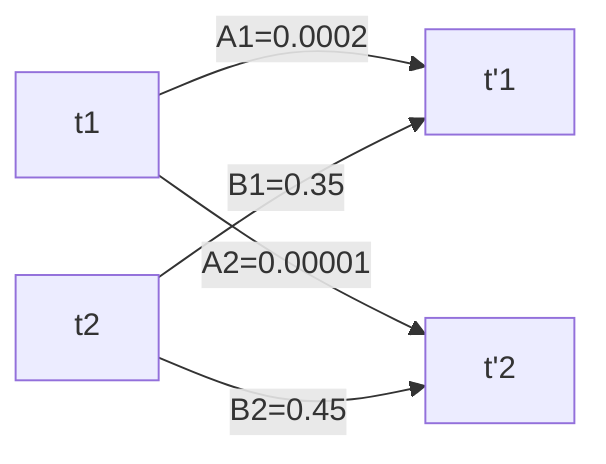
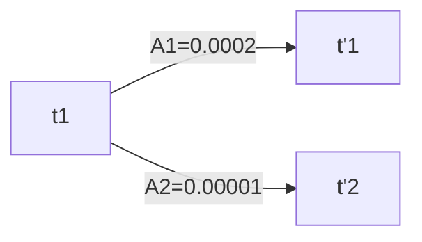
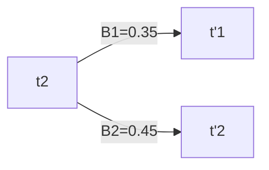

### Issues of MEMM (MaxEnt Markov Model)
-  We normalize the value of  $e^{\sum\limits_{i = 1}^N \lambda_i f_i( \ h,\ t)}$   each time we transition from one state to another this causes Label Bias problem .
- Suppose we have two initial tags  $t_1$, $t_2$  and they transition to tags  $t'_1$ ,  $t'_2$ , and let
    $\sum\limits_{i = 1}^N \lambda_i f_i( \ h,\ t_1, \ \{t'_1 , t'_2\})$  = {$A_1, A_2$}  and 
   $\sum\limits_{i = 1}^N \lambda_i f_i( \ h,\ t_2, \ \{t'_1 , t'_2\})$ = {$B_1 , B_2$}.
   

-  if we want the probability of  $t_1 ---> t'_1$  we normalize by  $Z$.

and  $Z = \sum\limits_{t} exp \; \{\; A_i \; \} = e^{0.0002} + e^{0.00001} = 1.0002 + 1.00001 = 2.00021$
-  For $P(t_1 \ t'_1 \ | \ h) = \frac{e^{0.0002}}{e^{0.0002} + e^{0.00001}} = \frac{1.0002}{2.00021} = 0.50004$

-  Lets calculate the same for  $t2 --->t'_1$,

and  $Z = \sum\limits_{t} exp \; \{\; A_i \; \} = e^{0.35} + e^{0.45} = 1.4190 + 1.5683 = 2.9873$
-  For $P(t_2 \ t'_1 \ | \ h) = \frac{e^{0.35}}{e^{0.35} + e^{0.45}} = \frac{1.4190}{2.9873} = 0.4750$

-  As you can see that  $P(t_1t'_1 \ | \ h) \  \gt \ P(t_2 \ t'_1 \ | \ h)$   even though  $A_1  << B_1$. This is called Label Bias problem.
- The normalization at each state is introducing some bias when computing the probability for tag sequence.
- This is fixed by the Conditional Random Field .

## Conditional Random Fields (Linear Chain)
-  It is almost identical to the MaxEnt Markov Model except there is a change in the formulation of computing $P( \ T \ | \ W \ )$ .
-  We will compute the expectation feature value for each tag sequence from start to the end of the sentence.
$$P_\lambda(t | w) = \frac{1}{Z_{\lambda}(w)} \cdot exp \; \{\; \sum\limits_{i = 1}^n \sum\limits_j \lambda_j f_j(t_{i-1}, t_i, w)\; \}$$
$$Z_{\lambda}(w) = \sum\limits_{t \ \epsilon \ T} exp \; \{\; \sum\limits_{i = 1}^n \sum\limits_j \lambda_j f_j(t_{i-1}, t_i, W)\; \}$$
where, $t = \{ t_1,...,t_n\}$  is one of many possible tag sequences and $w=\{ w_1,..., w_n\}$ is the given sentence.  $j$ represents the feature number.

-  Derivation is simple we just multiply the exponent terms over all steps  $n$  i.e.
$$\prod\limits_{i = 1}^n e^{ \ \sum\limits_j \lambda_j f_j(t_{i-1}, t_i, w)} = e^{ \ \sum\limits_{i = 1}^n \sum\limits_j \lambda_j f_j(t_{i-1}, t_i, w)}$$
-  Understand it this way ,
$$e^x \cdot e^y = e^{x+y}$$
- Similarly we have ,
$$Z(w) = \sum\limits_{t \ \epsilon \ T} e^{ \; \sum\limits_{i = 1}^n \sum\limits_j \lambda_j f_j(t_{i-1}, t_i, W)\;}$$
$T$  represents all possible tags at all the steps (words). We are basically covering all the possible tag sequences.

-  CRFs  have the advantages of MEMM  as well as  avoid the label bias problem .
- CRFs  are globally normalized, whereas MEMMs  are locally normalized.
- They are widely used and applied in Natural Language Processing.
- CRFs  are considered close to  state of the art approach in many sequence labelling tasks (POS tagging , Named Entity Recognition (NER) etc).

### References
-  [NPTEL NLP Course]([https://youtu.be/LFuuNYF7Pc0](https://youtu.be/LFuuNYF7Pc0 "Share link"))