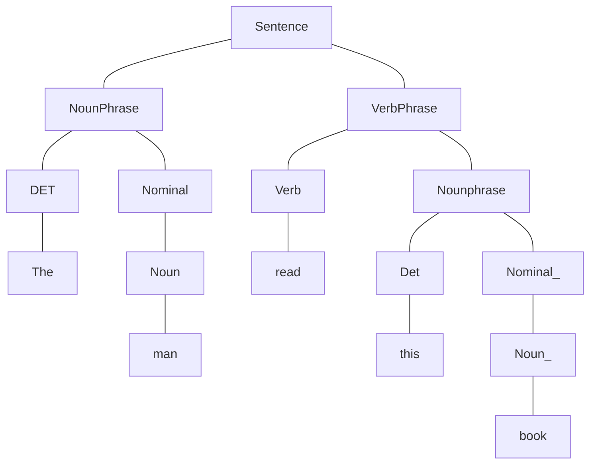

-  Syntax refers to the way words are arranged together and the relationship between them.
-  Syntax discusses about more complex notions than word order (Language Models) and equivalence class for words (POS categories) such as constituency (phrases, clauses), grammatical relations, subcategorization etc.
- Lets see an example  Syntax Tree of a sentence - "$The \ man \ read \ this \ book$ "

-  The words, phrases or clauses that function as nouns are called nominals.

#### Constituency
-  A group of words that act as a single unit - phrases, clauses etc.
-  Eg:
	- "$Kermit \ the \ frog$"
	- "$they$"
	- "$December \ twenty \ - \ sixth$"
	- "$the \ reson \ he \ is  \ running \ for \ president$"
-  The above examples are known as Noun Phrases.

-  For determining if a phrase is a noun phrase or adjective phrase or prepositional phrase or verb phrase by checking the POS tag of the head of a phrase.
- Eg:
	- "$the \ man \ from \ Amherst$" - is a noun phrase because the head man is a noun.
	- "$extremely \ clever$" - is an adjective phrase because the head clever is an adjective.
	- Similarly  "$down \ the \ river$"  and  "$killed \ the \ rabit$"  are prepositional and verb phrases respectively.

- Words can also act as phrases and they can be replaced by there respective constituent phrase.
- Eg: 
	- "$Joe \ grew \ potatoes.$"
	-  Here $Joe$  and  $potatoes$  are both nouns and noun phrases.
	- Compare with:  "$The \ man \ from \ Amherst \ grew \ russet \ potatoes$"
	-  $Joe$  is replace by  $The \ man \ from \ Amherst$  and  $potatoes$  is replaced by $russet \ potatoes$.

-  Constituent phrases appear in similar environments
- Eg:
	- $Kermit \ the \ frog$  comes on stage
	- $They$  come to Massachusetts every summer.
	- $December \ twenty-sixth$  comes after Christmas.
	- $The \ reason \ he \ is \ running \ for \ president$  comes out only now.
-  You can see that  $come(s)$  is common after each noun phrase.
- But not each individual word in the constituent can written in such an environment like 
	-  $^*The$  comes our...  ❌
	-  $^*is$  comes out....  ❌
	-  $^*for$  comes out....  ❌

-  These constituent phrases can be placed in a number of different locations like
	- Constituent = Prepositional phrase:  $On \ December \ twenty \ - \ sixth$
		-  $On \ December \ twenty \ -  \ sixth \ I'd \ like \ to \ fly \ to \ Florida$ .  ✔️
		-  $I'd \ like \ to \ fly \ on \ December \ twenty \ -  \ sixth \ to \ Florida$.  ✔️
		- $I'd \ like \ to \ fly \ to \ Florida \ On \ December \ twenty \ -  \ sixth$ .  ✔️ 
	- But you cannot split apart phrase and then place these parts in different location.
		-  $*On \ December \ I'd \ like \ to \ fly \ twenty \ - \ sixth \ to \ Florida$ .  ❌
		-   $*On \ I'd \ like \ to \ fly \ December \ twenty \ - \ sixth \ to \ Florida$.   ❌

- The most common way of modelling constituency is **Context Free Grammar**.

### Context Free Grammar
-  Context free grammar is a formal grammar which is used to generate all possible strings in a given formal language.
$$G= (T, N, R, S)$$
where ,
$G$  --->  describes the CFG.
$T$  --->  a finite set of terminal symbols.
$N$  --->  a finite set of non-terminal symbols.
$R$  --->  a set of rules (production rules) in the form  $$X ->\gamma, \ X \ \epsilon \ N \ and \ \gamma \ \epsilon \ (T \ \cup \ N)^*$$
(which basically means that the L.H.S of the rules should be a non-terminal and R.H.S  can be combination of both terminal and non-terminal symbols.)

$S$   --->  start symbol.

-  In CFG, the start symbol is used to derive a string. You can derive a string by repeatedly replacing a non-terminal by the right hand side of the production rules, until all non-terminal have been replaced by terminal symbols.
-  The production rules express the ways in which the symbols of the language can be grouped and ordered together.

- Eg:
  If the language is given by,
  $$L = \{wcw^R \ | \ w \ \epsilon \ (a,b)^*\}$$
  Production rules $P$  are,
	-  $S --> aSa$
	-  $S --> bSb$
	- $S --> c$
	Check that  $abbcbba$  string can be derived from the given CFG.
	   $S ⇒ aSa$  
	    $S ⇒ abSba$  
	    $S ⇒ abbSbba$  
	    $S ⇒ abbcbba$  

-  Now lets write an example set of production rules for modelling Constituency.
- Eg:
	- Noun phrase can be composed of either a Proper Noun or a determiner (DET)  followed by a Nominal;  Nominals can be single or multiple nouns.
		-  $NounPhrase ---> ProperNoun \ | \ DET \ Nominal$
		- $Nominal ---> Noun \ | \ Noun \ Nominal$

- In NLP, terminals mainly correspond to words in the language while pre-terminals mainly correspond to POS categories. 
-  We distinguish out a set  $P \subset N$   of pre-terminals, which always rewrite as terminals. That is, this subset of non-terminal will always resolve into a terminal symbol. 
- Eg:
  Suppose we have our production rules as,
	-  $NP --> DET \ Nominal$
	-  $NP --> ProperNoun$
	- $Nominal -->  Noun | Noun Nominal$
	- $DET --> a$
	- $DET --> the$
	- $Noun --> flight$
  Lets identify the terminals, non-terminals and pre-terminals?
	-  Terminals (words in lexicon) -   $a, the, flight$
	-  Pre-terminals  (resolve into terminals)-  $DET, Noun$
	-  Non - terminals  -  $NP, Nominal, ProperNoun, DET, Noun$

#### CFG as a generator
-  Suppose we have our previously defined production rules ,
	  $NP --> DET \ Nominal$
	-  $NP --> ProperNoun$
	- $Nominal -->  Noun | Noun Nominal$
	- $DET --> a$
	- $DET --> the$
	- $Noun --> flight$
- And we have to generate a sequence of words like  "$a \ flight$"
- We can generate that in the following order,
	-  $NP ⇒  DET \ Nominal$
	- $DET ⇒ a$
	- $Nominal ⇒ Noun$
	- $Noun ⇒ flight$
- then we get  "$a \ flight$"  and this is grammatically valid.
- Thus we can say that , CFGs can be used to randomly generate a series of strings.
- This sequence of rule expansions is called a derivation of the string of words, usually represented as a tree similar to the one shown at the very beginning of the article.

-  Lets look at this example as well which shows us how recursively we can generate sentences,
	- $PrepositionPhrase(PP) --> Preposition \ NounPhrase(NP)$
	- $NP -->  Noun \ PP$

-  Example sentence that can be generated using this grammar,
$$
\begin{split}
&[_S \ \ The \ \ mailman \ \ ate \ \ his \ \ [_{NP} \ \ lunch \ \ [_{PP} \ \ with \ \ [_{NP} \ \ his \ \ friend \ \ [_{PP}\ \ on \ \ [_{NP} \\\\ &the \ \  north \ \ end \ \ [_{PP} \ \ of \ \ town]]]]]]]
\end{split}
$$   
###  What does the context stand for in CFG?
-  The notion of context has nothing to do with the ordinary meaning of word context in a natural language.
- All it really means is that the non-terminals on the left-hand side of a rule is out there all by itself(free of context).
- Eg:
  we have this very simple production rule here,
	- $A -->BC$
	we can say that  non-terminal $A$  can transition to $BC$  without considering what is before $A$ or after $A$ . Somewhat like  this  $xAy --> xBCy$   irrespective of what $x$  and  $y$  denote,  they can be non-terminals, pre-terminals or terminals.

-  The context $x$  and  $y$  are important in case of context-sensitive grammar.